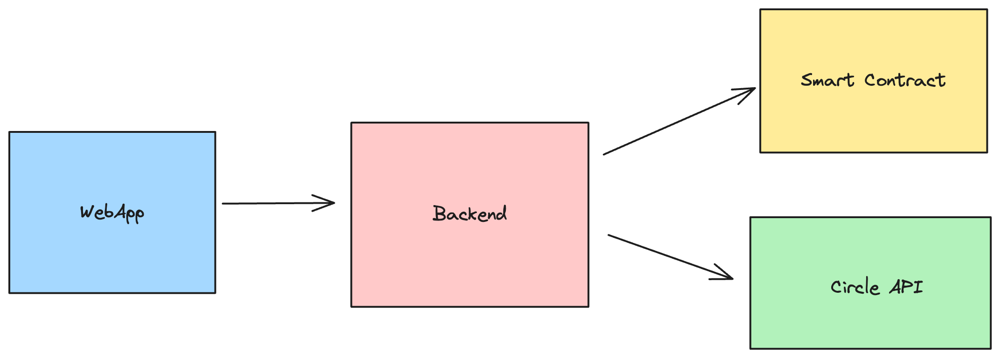

# BudAl

A simple budget allocating system using the [Circle](https://developers.circle.com/) API to abstract Web3 complexity.

## Architecture

BudAl is composed of 3 custom parts that work together:
- The WebApp: a simple React frontend to manage budget allocation.
- The Backend: an Express TypeScript application to handle the logic.
- The Smart Contract: an ERC 20 contract to store allocation on chain.

> 💡 We also use [Circle API](https://developers.circle.com/) to handle Web3 for us and the [Nouns DAO](https://nouns.wtf/) for cool assets.

## Motivations

Most standard banking systems such as [Qonto](https://qonto.com/en/payment-methods/card/virtual-card) include systems to create digital cards with pre-defined allocated budgets.

This is super useful to control the company's cash flow and set precise rules around spending.

BudAl is a Web3 implementation of this system, giving a seamless experience to allocate cryptocurrency for
buying goods and services.
Using a simple UI, you can create groups with specific budget allocation, rules of spending and limits.

Combining with Circle API gives a simple abstraction around wallets so you can perform secure and verified actions on the blockchain in few clicks.

BudAl is an accessible solution to democratize cryptocurrency usage around businesses.

## Launch the project

### Deploy the contract

// TODO(RGascoin): Add a guide to deploy the contract

### Run the backend

See [`./backend/README`](./backend/README.md) for running instructions.

### Run the frontend

See [`./webapp/README`](./webapp/README.md) for running instructions.

## Example of use case

See [USECASE.md](./USECASE.md) for an example of workflow using BudAl.

Made with ❤️ by [Quartz](https://quartz.technology)